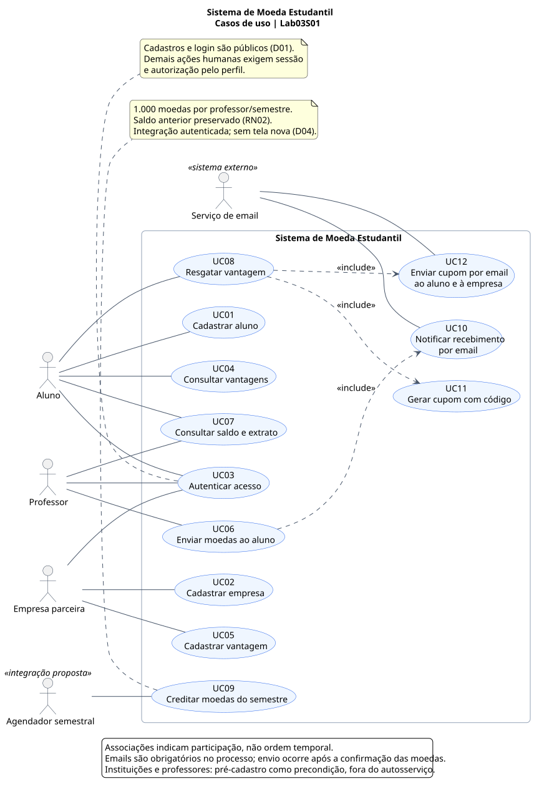

# Sistema de Moeda Estudantil

Projeto acadêmico da **PUC Minas**, curso de **Engenharia de Software**, disciplina **Projeto de Software**, professora **Milena Menezes Adão**. Laboratório 3, segundo semestre de 2026, valor de 20 pontos.

O sistema reconhece o mérito estudantil com moedas virtuais: professores premiam alunos por participação, comportamento e outras contribuições, e os alunos trocam essas moedas por produtos ou descontos de empresas parceiras.

## Integrantes

- Guilherme Horta Dias
- Lucas Batista Duarte
- Rafael Abras

## Entrega atual: Lab03S01

Este repositório contém a **modelagem proposta**, com base no enunciado `LABORATORIO_3_LAB_DESENVOLVIMENTO_DE_SOFTWARE.pdf` e em pesquisa complementar. Não há aplicação executável nesta entrega.

| Entregável | Documento | Código editável | Imagem |
| --- | --- | --- | --- |
| Casos de uso | [Especificação](docs/modelagem/casos-de-uso.md) | [PlantUML](docs/diagramas/casos-de-uso.puml) | [SVG](docs/diagramas/casos-de-uso.svg) / [PNG](docs/diagramas/casos-de-uso.png) |
| Histórias do usuário | [Histórias e critérios de aceitação](docs/modelagem/historias-do-usuario.md) | Markdown | Não se aplica |
| Classes | [Modelo de domínio](docs/modelagem/classes.md) | [PlantUML](docs/diagramas/classes.puml) | [SVG](docs/diagramas/classes.svg) / [PNG](docs/diagramas/classes.png) |
| Componentes | [Arquitetura MVC proposta](docs/modelagem/componentes.md) | [PlantUML](docs/diagramas/componentes.puml) | [SVG](docs/diagramas/componentes.svg) / [PNG](docs/diagramas/componentes.png) |

**Comece pelo [sumário completo](SUMARIO.md).** A [análise do enunciado](docs/analise-enunciado.md) distingue requisitos expressos, decisões de modelagem e dúvidas a confirmar. A [matriz de rastreabilidade](docs/modelagem/rastreabilidade.md) conecta os requisitos aos quatro entregáveis.

## Como o sistema funciona

1. Instituições e professores já estão pré-cadastrados. Alunos e empresas realizam seus cadastros.
2. Cada professor recebe **1.000 moedas a cada semestre**, somadas ao saldo restante.
3. O professor escolhe um aluno, informa a quantidade e uma justificativa obrigatória. O envio exige saldo suficiente e gera email ao aluno.
4. Alunos e professores consultam saldo e extrato. Empresas cadastram vantagens com descrição, foto e custo em moedas.
5. O aluno resgata uma vantagem: seu saldo é debitado e um cupom com código é enviado por email a ele e à empresa, para conferência na troca presencial.
6. Alunos, professores e empresas acessam as funções protegidas com login e senha.

As moedas são unidades de reconhecimento interno. O enunciado não especifica dinheiro real, compra de moedas, blockchain ou transferência entre alunos.

## Diagramas

### Casos de uso



### Classes


### Componentes


As figuras podem ser abertas em tamanho original pelos links da tabela. Os arquivos `.puml` são a fonte oficial; SVG e PNG são exportações dessa fonte. As histórias são textuais, pois **não constituem um tipo de diagrama UML**.

## Ferramenta e organização

Foi escolhido **PlantUML** para manter a notação UML dos três diagramas, editar em texto e versionar no Git. Consulte a [comparação de ferramentas e guia de notação](docs/pesquisa/diagramas-e-ferramentas.md) e as [instruções de reprodução](docs/diagramas/README.md).

```text
README.md                         Contexto e entrada do projeto
SUMARIO.md                        Navegação dos documentos
docs/analise-enunciado.md          Escopo, requisitos, decisões e lacunas
docs/plano-de-trabalho.md          Etapas e critérios de conferência
docs/pesquisa/                    Sistemas semelhantes e ferramentas
docs/modelagem/                   Quatro entregáveis e rastreabilidade
docs/diagramas/                   Fontes PlantUML e imagens SVG/PNG
scripts/                         Reprodução dos diagramas e verificação documental
```

## Limites e próximas sprints

| Etapa do laboratório | Exigência do PDF | Situação neste repositório |
| --- | --- | --- |
| Lab03S01 | Casos de uso, histórias, classes e componentes | Modelagem documentada |
| Lab03S02 | Modelo ER, estratégia de persistência e CRUDs iniciais de aluno e empresa | Fora da entrega atual |
| Lab03S03 | CRUDs finais, apresentação de arquitetura e persistência, slides | Fora da entrega atual |
| Apresentação final | Protótipo e tutorial das tecnologias; 20 minutos | Planejamento futuro |

A arquitetura MVC é uma exigência do enunciado; linguagem, framework, banco e ORM/DAO ainda não foram escolhidos. Os componentes descrevem responsabilidades lógicas e contratos, sem impor microserviços ou tecnologias. Recursos encontrados em outros produtos só entram na modelagem quando necessários ao enunciado; as demais ideias estão registradas como sugestões futuras.

## Manutenção e conferência

- Atualize os `.puml`, gere as imagens novamente e revise os documentos relacionados.
- Mantenha os identificadores `RF`, `RN`, `UC` e `HU` alinhados com a matriz de rastreabilidade.
- Verifique links e exportações conforme o [guia dos diagramas](docs/diagramas/README.md).
- Preserve o histórico das alterações no Git; não substitua os modelos por imagens sem fonte.
- Revise com o grupo as decisões abertas antes de implementar as próximas sprints.

## Referências e licença

O enunciado fornecido é a fonte principal. As fontes externas, com links e data de consulta, estão nos documentos de [sistemas semelhantes](docs/pesquisa/sistemas-semelhantes.md) e [diagramas e ferramentas](docs/pesquisa/diagramas-e-ferramentas.md).

Não foi definida licença de distribuição para este trabalho pelo grupo. A licença da ferramenta PlantUML não define automaticamente a licença dos documentos produzidos.
