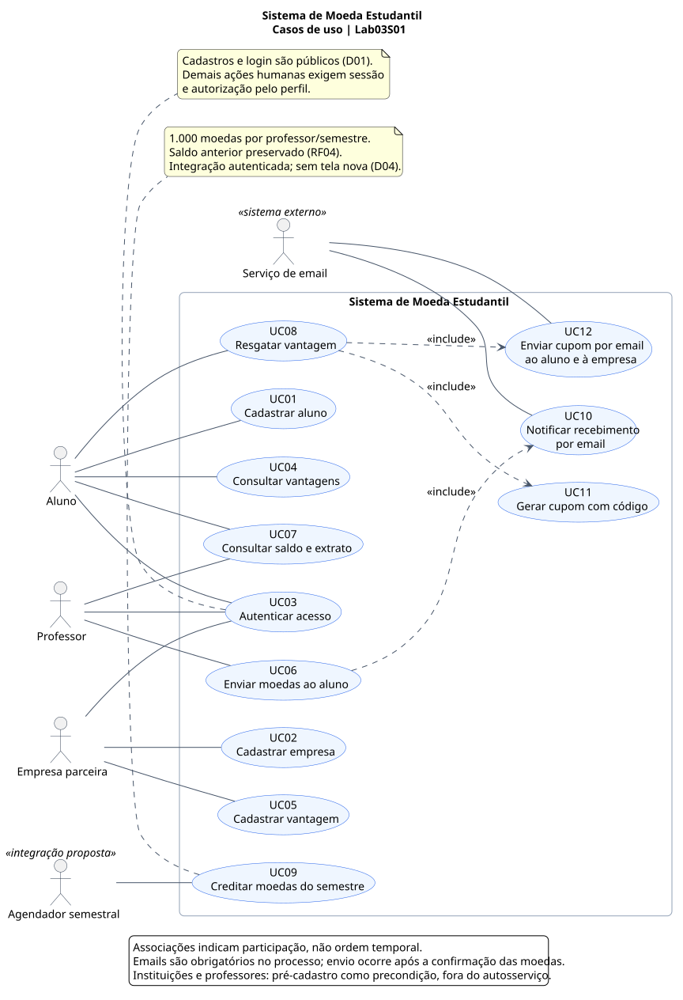

# Diagrama e especificação de casos de uso

[Sumário](../../SUMARIO.md) · [Fonte PlantUML](diagramas/casos-de-uso.puml) · [SVG](diagramas/casos-de-uso.svg) · [PNG](diagramas/casos-de-uso.png)

Os casos de uso representam os objetivos dos atores. A figura e os fluxos abaixo compõem este entregável. As escolhas D01–D11 estão em [requisitos e decisões](requisitos.md).

## Atores e fronteira

| Ator | Objetivo/participação |
| --- | --- |
| Aluno | Cadastrar-se, autenticar-se, consultar vantagens, saldo/extrato e resgatar |
| Professor | Autenticar-se, reconhecer aluno enviando moedas e consultar saldo/extrato |
| Empresa parceira | Cadastrar-se, autenticar-se e cadastrar vantagens |
| Agendador semestral | Disparar crédito periódico, como integração proposta em D04 |
| Serviço de email | Participar do envio de notificações, como sistema externo de apoio |

Receber um email é consequência dos fluxos de envio e resgate, não exige que seu destinatário opere uma tela. A empresa confere o cupom **presencialmente**, usando o email recebido; não foi criado um caso de uso de baixa online.

Instituições e professores são dados pré-cadastrados; sua preparação é precondição de uso.

## Convenções e precondições comuns

- UC01, UC02 e UC03 são públicos, pela decisão D01.
- UC04 a UC08 exigem sessão válida e perfil autorizado; UC07 atende aluno e professor, com visibilidade apenas da própria conta.
- UC09 exige integração autenticada, período identificado e professores pré-cadastrados.
- UC10, UC11 e UC12 são comportamentos incluídos, executados internamente no contexto da operação autorizada. Não expõem endpoint público de emissão de cupom.
- Quantidade/custo positivo, aluno com saldo inicial zero, resgate com saldo suficiente e isolamento de contas são decisões D02/D05.
- Em recusas de negócio, não alterar saldo, não registrar operação confirmada, não gerar cupom e não enviar notificação de sucesso.

## UC01 — Cadastrar aluno

**Ator:** Aluno. **Requisitos:** RF01, RF02, RF16. **História:** HU01.

**Precondição:** instituições já cadastradas. **Fluxo principal:** (1) informar nome, email, CPF, RG, endereço, curso, login e senha; (2) selecionar instituição da lista existente; (3) sistema validar dados e disponibilidade do login; (4) criar aluno e conta com saldo zero; (5) confirmar cadastro.

**Alternativas:** campo obrigatório ausente, instituição inexistente ou login já utilizado → rejeitar e orientar correção, sem cadastro parcial.

**Pós-condição:** aluno vinculado a uma instituição e habilitado a autenticar-se; cadastro não concede moedas.

## UC02 — Cadastrar empresa

**Ator:** Empresa parceira. **Requisitos:** RF10, RF16. **História:** HU02.

**Fluxo principal:** (1) informar nome e email, adotados em D03, login e senha; (2) sistema validar campos e unicidade do login; (3) criar empresa; (4) confirmar cadastro. **Alternativas:** dados ausentes ou login indisponível → rejeitar sem criar empresa.

**Pós-condição:** empresa habilitada a autenticar-se. Não cria conta de moedas nem exige vantagem inicial; cadastro de vantagem é UC05 (D08).

## UC03 — Autenticar acesso

**Atores:** Aluno, Professor, Empresa parceira. **Requisito:** RF16; RF03 como precondição do professor. **Histórias:** HU03, HU14.

**Precondição:** cadastro com credenciais existente. **Fluxo principal:** (1) informar login/senha; (2) verificar credenciais; (3) identificar perfil; (4) estabelecer sessão autorizada. **Alternativa:** credenciais inválidas → negar acesso sem expor senha ou criar sessão.

**Pós-condição:** sessão válida para as funções do perfil. Professor usa suas credenciais pré-cadastradas; não há inscrição pública de professor. O pré-cadastro conserva nome, CPF, departamento e instituição.

## UC04 — Consultar vantagens

**Ator:** Aluno. **Requisito:** RF09. **História:** HU04.

**Fluxo principal:** (1) solicitar catálogo; (2) sistema apresentar vantagens com descrição, foto, custo em moedas e empresa; (3) aluno selecionar a vantagem desejada. **Alternativa:** catálogo vazio → informar que não há vantagens cadastradas.

**Pós-condição:** escolha disponível para UC08; consultar/selecionar não desconta moedas. Preço e saldo são reavaliados na confirmação do resgate, não somente na abertura do catálogo.

## UC05 — Cadastrar vantagem

**Ator:** Empresa parceira. **Requisito:** RF11. **História:** HU05.

**Fluxo principal:** (1) informar descrição, foto e custo; (2) validar custo inteiro positivo e campos; (3) associar a vantagem à empresa da sessão; (4) disponibilizar no catálogo. **Alternativas:** descrição/foto ausente ou custo inválido → não publicar; tentativa de vincular a outra empresa → negar.

**Pós-condição:** vantagem pertence a exatamente uma empresa.

## UC06 — Enviar moedas ao aluno

**Ator:** Professor. **Requisito:** RF05. **História:** HU07. **Inclui:** UC10.

**Precondições:** professor e aluno cadastrados, vínculo conforme D09, sessão de professor. **Fluxo principal:** (1) escolher aluno; (2) informar montante e motivo aberto; (3) validar destinatário, quantidade positiva, motivo não vazio e saldo suficiente; (4) debitar professor, creditar aluno e registrar um reconhecimento em operação atômica; (5) acionar notificação do aluno; (6) apresentar resultado.

**Alternativas:** saldo insuficiente, destinatário inválido, instituição incompatível ou motivo em branco → rejeitar sem movimentação. Dois envios simultâneos devem validar saldo no momento da confirmação, sem gerar saldo negativo. Falha de email após confirmação → seguir UC10, sem desfazer silenciosamente o reconhecimento.

**Pós-condição:** a mesma quantidade saiu de uma conta e entrou na outra; um único reconhecimento aparece como saída no extrato do professor e entrada no do aluno.

## UC07 — Consultar saldo e extrato

**Atores:** Aluno e Professor. **Requisitos:** RF07, RF08. **Histórias:** HU09, HU10.

**Fluxo principal:** (1) solicitar a própria conta; (2) apresentar saldo atual; (3) apresentar histórico com data, quantidade, natureza e referências; (4) distinguir saída de envio, entrada de recebimento e saída de resgate conforme perfil.

**Alternativas:** nenhuma movimentação → saldo e histórico vazio; pedido para conta alheia ou por empresa → negar. Crédito semestral é apresentado adicionalmente no extrato do professor para explicar o saldo, conforme decisão de representação.

**Pós-condição:** apenas leitura. Motivo e professor aparecem nos recebimentos; aluno e motivo nos envios; vantagem e código do cupom nos resgates.

## UC08 — Resgatar vantagem

**Ator:** Aluno. **Requisito:** RF12. **História:** HU11. **Inclui:** UC11 e UC12.

**Precondições:** sessão de aluno, vantagem cadastrada e saldo suficiente (D02). **Fluxo principal:** (1) escolher vantagem; (2) consultar custo atual e confirmar; (3) validar saldo/custo; (4) debitar aluno, registrar resgate com valor histórico e gerar cupom único na mesma operação; (5) preparar os dois emails com o mesmo código; (6) confirmar resgate.

**Alternativas:** vantagem inexistente, saldo insuficiente ou custo inválido → não debitar; falha ao gerar cupom ou persistir qualquer parte → operação inteira não é confirmada; falha de envio após confirmação → reprocessar email, sem novo débito/cupom.

**Pós-condição:** um resgate, um cupom e custo debitado uma vez. A empresa não recebe moedas em carteira. A entrega do produto/desconto ocorre fora do sistema, presencialmente.

## UC09 — Creditar moedas do semestre

**Ator:** Agendador semestral (D04). **Requisito:** RF04. **História:** HU06.

**Fluxo principal:** (1) identificar semestre e professor; (2) verificar ausência de crédito para esse par; (3) somar 1.000 ao saldo e registrar crédito semestral; (4) repetir para os demais professores elegíveis. **Alternativa:** crédito já existente → não duplicar. Cada crédito individual deve ser atômico; reexecutar processamento interrompido preserva créditos já feitos.

**Pós-condição:** saldo anterior preservado e crédito rastreável. Não há crédito para alunos/empresas. Calendário e elegibilidade no ingresso tardio são questões abertas, não resolvidas por este caso de uso.

## UC10 — Notificar recebimento por email

**Ator de apoio:** Serviço de email. **Requisito:** RF06. **História:** HU08. **Incluído por:** UC06.

**Precondição:** reconhecimento confirmado. **Fluxo principal:** preparar mensagem ao email do aluno com referência ao reconhecimento, solicitar envio e registrar resultado. **Alternativa:** envio falha → registrar falha e permitir reprocessamento, sem repetir movimentação.

**Pós-condição:** solicitação rastreável; envio deve ser concluído pelo componente de notificação. Aceite do provedor não equivale a prova de leitura pelo aluno. Conteúdo com quantidade, professor e motivo é a proposta adotada para explicar a premiação.

## UC11 — Gerar cupom com código

**Requisito:** RF13. **História:** HU12. **Incluído por:** UC08.

**Fluxo principal:** gerar código único, associar cupom ao resgate e registrar emissão. A criação integra a transação de UC08: somente existe como cupom confirmado quando o resgate também foi confirmado. **Alternativa:** colisão de código → gerar outro; impossibilidade de criação → não confirmar o resgate.

**Pós-condição:** um cupom por resgate; acesso ao código permite conferência presencial.

## UC12 — Enviar cupom por email ao aluno e à empresa

**Ator de apoio:** Serviço de email. **Requisitos:** RF14, RF15. **Histórias:** HU12, HU13. **Incluído por:** UC08.

**Precondição:** resgate/cupom confirmados. **Fluxo principal:** (1) obter email do aluno e da empresa da vantagem; (2) preparar mensagens com o mesmo código e identificação da vantagem; (3) enviar às duas partes e registrar resultados individuais.

**Alternativa:** um envio falha → reprocessar somente a notificação pendente/falha, preservando o código original e o débito. **Pós-condição:** as duas mensagens devem chegar aos respectivos serviços de email; confirmação de leitura ou entrega física não é controlada pelo sistema proposto.

## Leitura das relações

`UC06 → UC10`, `UC08 → UC11` e `UC08 → UC12` são `<<include>>`: os comportamentos são necessários no processo. Isso não significa que o envio externo do email participe da transação do banco. O sistema registra/prepara notificações e trata a entrega externa após a confirmação (D07).

Login é precondição das operações protegidas; a sessão pode atender a várias ações.
