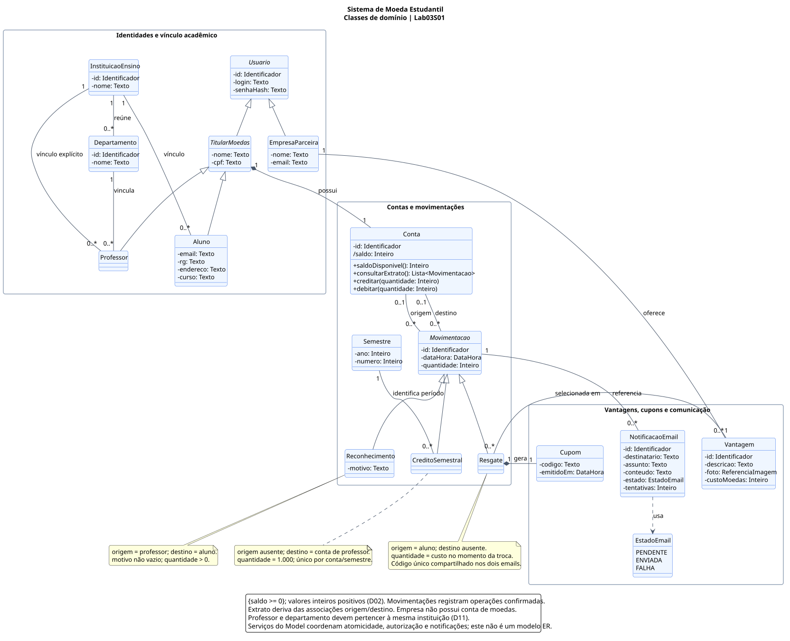

# Diagrama de classes

[Sumário](../../SUMARIO.md) · [Fonte editável](diagramas/classes.puml) · [SVG](diagramas/classes.svg) · [PNG](diagramas/classes.png)

Este modelo define as entidades do negócio, seus dados e relacionamentos para orientar a implementação. Os atributos e as multiplicidades estão na figura; as regras que precisam de explicação estão abaixo.

## Organização do domínio

| Grupo | Responsabilidade |
| --- | --- |
| Identidades e vínculo acadêmico | `Usuario` reúne credenciais. `TitularMoedas` reúne nome/CPF de aluno e professor. Alunos e professores se vinculam à instituição; professor também se vincula a departamento. `EmpresaParceira` oferece vantagens. |
| Contas e movimentações | Cada titular possui uma `Conta`. `Movimentacao` é especializada em crédito semestral, reconhecimento e resgate, permitindo explicar o saldo e o extrato. |
| Vantagens, cupons e comunicação | `Vantagem` pertence à empresa. Cada `Resgate` possui um `Cupom`. `NotificacaoEmail` registra o envio das mensagens e suas tentativas. |

Nome e CPF de aluno/professor são herdados de `TitularMoedas`; login e senhaHash são herdados de `Usuario`. Os demais campos exigidos aparecem diretamente nas classes e associações. Os tipos são conceituais; CPF e RG são textos, e `ReferenciaImagem` representa a foto da vantagem.

## Regras das movimentações

| Tipo | Origem | Destino | Regra específica |
| --- | --- | --- | --- |
| `CreditoSemestral` | Ausente | Conta do professor | 1.000 moedas, um crédito por professor/semestre; preserva saldo anterior |
| `Reconhecimento` | Conta do professor | Conta do aluno | Motivo obrigatório; mesma quantidade debitada e creditada |
| `Resgate` | Conta do aluno | Ausente | Valor debitado igual ao custo na confirmação; um cupom por resgate |

Uma movimentação confirmada gera as entradas/saídas dos extratos. O reconhecimento é um único registro consultado por professor e aluno. O saldo deriva de **entradas menos saídas**, e as operações devem preservar saldo não negativo.

## Relações que exigem atenção

- Aluno/professor possuem uma conta cada; a empresa não possui conta de moedas.
- Professor e seu departamento pertencem à mesma instituição.
- Cada vantagem pertence a uma empresa; uma empresa pode oferecer várias vantagens.
- Cada resgate confirmado possui exatamente um cupom, com código único.
- Reconhecimento demanda um email ao aluno; resgate demanda dois emails com o mesmo código. A multiplicidade `0..*` das notificações permite representar mensagens ainda em processamento.
- Os losangos indicam composição: conta vinculada ao titular e cupom vinculado ao resgate. Isso não determina exclusão em cascata dos registros na futura persistência.

O serviço de moedas do [modelo de componentes](componentes.md) coordena débito, crédito, registro e cupom em conjunto. As escolhas complementares estão em [requisitos e decisões](requisitos.md).
