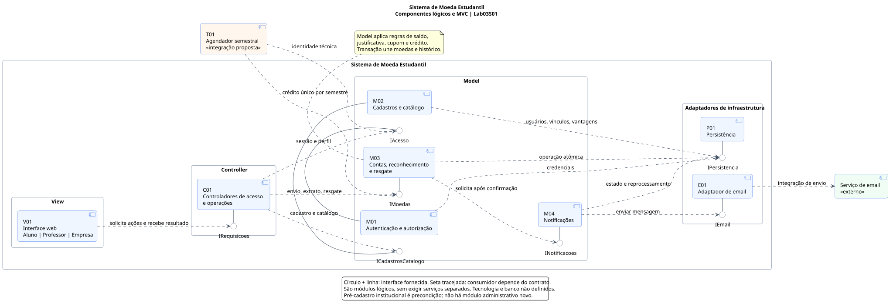

# Diagrama de componentes

[Sumário](../../SUMARIO.md) · [Fonte editável](diagramas/componentes.puml) · [SVG](diagramas/componentes.svg) · [PNG](diagramas/componentes.png)

A arquitetura segue **MVC**, conforme o enunciado. Os componentes representam módulos lógicos que podem fazer parte de uma mesma aplicação. Linguagem, framework, banco e estratégia de acesso aos dados serão definidos na implementação.

## Componentes e contratos

| Componente | Responsabilidade | Interface fornecida |
| --- | --- | --- |
| V01 — Interface web (**View**) | Formulários e telas dos três perfis; apresentação de catálogo, saldo e extrato | Consome `IRequisicoes` |
| C01 — Controladores (**Controller**) | Receber ações, conferir sessão/perfil e encaminhar aos serviços do Model | `IRequisicoes` |
| M01 — Autenticação e autorização (**Model**) | Verificar credenciais, sessão e permissão de usuário/integração | `IAcesso` |
| M02 — Cadastros e catálogo (**Model**) | Cadastrar aluno/empresa, consultar instituições e publicar/consultar vantagens | `ICadastrosCatalogo` |
| M03 — Contas, reconhecimento e resgate (**Model**) | Aplicar regras de moedas, consultar extrato, creditar semestre e gerar cupom | `IMoedas` |
| M04 — Notificações (**Model**) | Preparar mensagens das operações confirmadas e reprocessar falhas | `INotificacoes` |
| P01 — Persistência | Ler/gravar registros e confirmar alterações relacionadas de forma atômica | `IPersistencia` |
| E01 — Adaptador de email | Solicitar envio ao provedor e retornar resultado | `IEmail` |
| T01 — Agendador semestral | Integração proposta para solicitar o crédito por semestre após autenticar-se | Consome `IAcesso` e `IMoedas` |

O serviço de email está fora da aplicação. Círculos indicam interfaces fornecidas; setas tracejadas apontam do consumidor ao contrato utilizado.

## Fluxos principais

**Cadastro e acesso:** View → Controller → autenticação ou cadastros → persistência. Cadastro inicial e login são públicos; operações protegidas exigem perfil autorizado. Instituições e professores chegam pré-cadastrados pelo processo de parceria.

**Envio de moedas:** Controller → M03 → persistência. M03 valida saldo, aluno e motivo e confirma débito do professor, crédito do aluno e reconhecimento juntos. Após a confirmação, M04 envia o email por E01.

**Resgate:** Controller → M03 → persistência. M03 valida custo/saldo e confirma débito, resgate e cupom juntos. M04 envia ao aluno e à empresa o mesmo código. E01 apenas envia mensagens; não altera moedas nem gera cupons.

**Crédito semestral:** T01 autentica-se em M01 e solicita a M03 o crédito de 1.000 por professor/semestre. A persistência impede duplicação e preserva o saldo restante.

View acessa as funções por Controller. Regras de negócio ficam no Model; detalhes de banco e provedor ficam nos adaptadores. Falhas de email são tratadas como notificações pendentes/falhas, sem repetir a movimentação confirmada.

As interfaces são contratos conceituais, ainda sem endpoints ou assinaturas de uma linguagem. As [decisões de modelagem](requisitos.md) registram o que foi proposto além das exigências explícitas.
