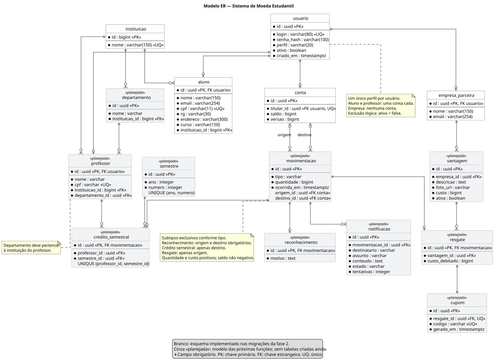

# Modelo ER e persistência — fase 2

[Sumário](../../SUMARIO.md) · [Código do diagrama](diagramas/modelo-er.puml) · [SVG](diagramas/modelo-er.svg) · [PNG](diagramas/modelo-er.png)

O diagrama cobre o sistema previsto nos requisitos. **As cinco tabelas brancas estão implementadas; as tabelas cinzas são planejamento das próximas funções.** O estado real do banco é definido pelas [migrações Flyway](../../backend/src/main/resources/db/migration/).

## Estratégia implementada

**ORM:** Jakarta Persistence (JPA), implementada pelo Hibernate. **Acesso aos dados:** interfaces Spring Data JPA `Repository`. Esse é o ponto de abstração da persistência; criar DAOs paralelos repetiria a mesma responsabilidade.

**Banco:** PostgreSQL 17.11, executado por Docker Compose. Flyway aplica alterações versionadas na inicialização. `spring.jpa.hibernate.ddl-auto=validate` confere o mapeamento; Hibernate não cria nem modifica o esquema. Não se usa H2 como substituto nos testes.

**MVC:** React apresenta a View; controllers expõem HTTP; services compõem o Model com as entidades e regras; repositories fazem o acesso ao banco. DTOs limitam o que entra e sai da API. `open-in-view=false` impede consultas implícitas durante a serialização da resposta.

O cadastro do aluno é uma transação: **usuário + aluno + conta com saldo zero**. O cadastro da empresa grava **usuário + empresa**, sem conta. Restrições `UNIQUE`, `NOT NULL`, `CHECK` e chaves estrangeiras complementam a validação da aplicação. Duplicidades retornam 409, inclusive em conflito concorrente, com rollback da transação.

`usuario.id` também é a chave de aluno/empresa (`@MapsId`). Um login pertence a um único perfil. O login é normalizado para minúsculas. Cada conta tem titular único e saldo não negativo; a coluna de versão prepara controle otimista para futuras movimentações. O CPF tem unicidade e formato de 11 dígitos; a versão inicial não verifica dígitos de controle nem consulta cadastros externos.

## Cadastros e segurança

- Cadastro inicial é público. Consulta, atualização e inativação exigem sessão e acesso ao próprio cadastro. A listagem retorna somente o registro do titular, sem expor dados pessoais dos colegas. Não existe administrador no escopo atual.
- Senhas usam BCrypt; mínimo de 8 caracteres e máximo de 72 bytes em UTF-8. Login e logout são tratados pelo Spring Security, com sessão HttpOnly e proteção CSRF. O React consulta `/api/auth/csrf` antes de cada alteração.
- `DELETE` inativa o usuário e encerra a sessão atual. Dados e conta são conservados para histórico; sessões remanescentes também são impedidas de acessar os cadastros pelo serviço. Login e CPF continuam reservados. Não há reativação nesta versão.
- Nome e email são os campos mínimos da empresa. Login e senha são informados somente no cadastro inicial e não são editáveis pelo CRUD desta fase.
- A lista inicial contém PUC Minas como base acadêmica. A lista oficial de instituições participantes e os professores ainda precisam ser confirmados.

Estas são decisões de implementação do grupo, complementando os [requisitos e decisões](requisitos.md). A exclusão por inativação, a política de senha e o acesso ao próprio cadastro não são exigências literais do PDF.

## Relações e regras das funções futuras

Professor terá instituição e departamento coerentes entre si. Aluno e professor terão uma conta; empresa poderá publicar várias vantagens. Uma movimentação será reconhecimento, crédito semestral ou resgate, com o subtipo correspondente. Origem/destino serão obrigatórios conforme o tipo, como indicado no diagrama.

Crédito terá unicidade por professor/semestre. Resgate conservará o custo debitado e terá exatamente um cupom, com código único. Notificações serão persistidas para envio após o commit e repetição independente da movimentação. As restrições entre subtipos e perfis precisarão de validação transacional e, quando apropriado, restrições adicionais nas novas migrações.

Envio de moedas, agendamento, vantagens, cupons, SMTP e notificações **ainda não estão implementados**. Mailpit para desenvolvimento e SMTP via Spring Mail serão introduzidos quando os emails de movimentação entrarem no escopo. Não há email de boas-vindas previsto no enunciado.

## Verificação

Os testes de integração em `backend/src/test` usam PostgreSQL real com Testcontainers e verificam cadastros, saldo inicial, hash da senha, rollback em duplicidade, autorização e inativação. Os testes de navegador em `frontend/e2e` percorrem os dois CRUDs contra o backend real. Comandos de execução estão no [README](../../README.md).
